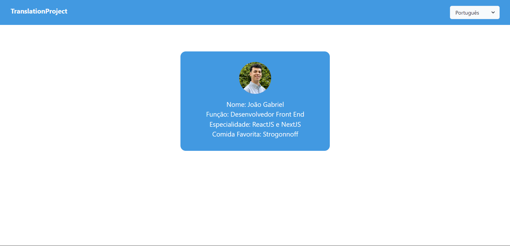

<h1 align="center"> I18n-with-no-libs </h1>

  <a href="#-tecnologias">Tecnologias</a>&nbsp;&nbsp;&nbsp;|&nbsp;&nbsp;&nbsp;
  <a href="#-projeto">Projeto</a>&nbsp;&nbsp;&nbsp;|&nbsp;&nbsp;&nbsp;
  <a href="#memo-licença">Licença</a>

  

 

  

## 🚀 Tecnologias

Esse projeto foi desenvolvido com as seguintes tecnologias:

- React
- TypeScript
- ChakraUI

## 🔥 Algumas features neste projeto

- React Context API
- Estilização com ChakraUI
- Criação de esquemas de linguagem com TypeScript

## ✨ Neste projeto você pode ver

- Um simples layout criado com ChakraUI.
- Um botão que quando clicado muda a linguagem dos textos do site.
- Um texto de exemplo que muda de acordo com a linguagem selecionada.

## 💻 Projeto

- Este projeto é uma aplicação com internacionalização, mas criada somente com ReactJS sem o uso de nenhuma lib.

## 📝 Licença

Esse projeto está sob a licença MIT.

---
